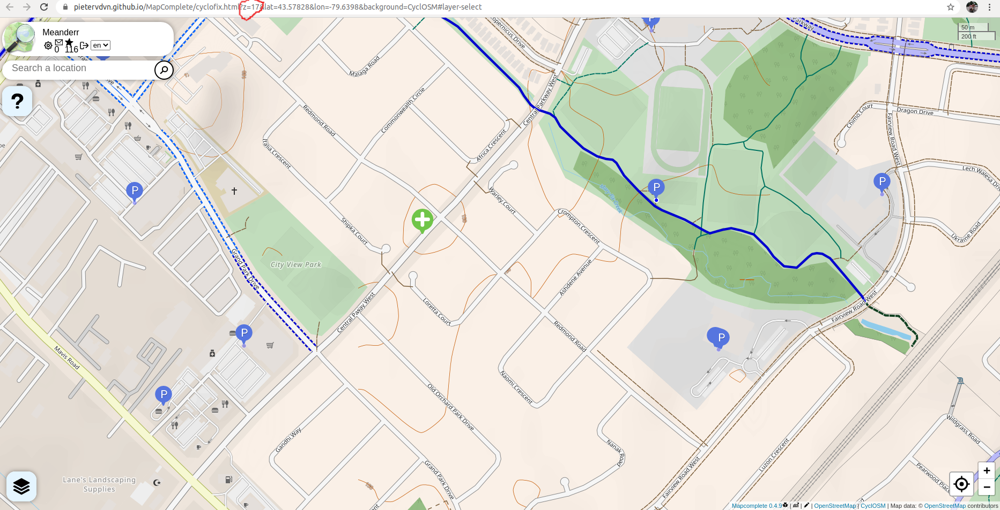

# Edit Map Complete
Goto <a href="https://mapcomplete.osm.be/cyclofix?z=13&lat=43.59102&lon=-79.6015&background=CyclOSM&layer-bike_cafes=false&layer-bicycle_library=false&layer-bicycle_tube_vending_machine=false&layer-bike_themed_object=false&layer-bike_cleaning=false&layer-bike_shops=false">Map Complete</a> and click the "Login with OpenStreetMap" button in the top left to begin editing OpenStreetMap using Map Complete:

Zoom into the map to at least zoom level 17 to be able to see the existing bike parking:

Click map where you want to add bike parking:  

Click this new point to select what type of point you want to add.  Choose Bike parking from the options:  

Confirm that you'd like to proceed to add bike parking in that location:  

Select the type of bike parking based on the example images and click Save:  

Enter the capacity of the bike parking and what type of access there is to use the bike parking and press Save on your answers to both questions:  

If you notice something is wrong on bike parking that someone else had added you can click on that bike parking and choose the Pencil icon next to that attribute to be able to reanswer the quenstion and change the attribute:  

Once you've finished all your changes on the map your changeset will automatically be added OpenStreetMap 1 hour after your last change.  Congratulations and thank you for contributing to OpenStreetMap and the Mississauga Bike Parking Map.

It may take up to 12 hours for your change to be reflected on the Mississauga Bike Parking Map. 