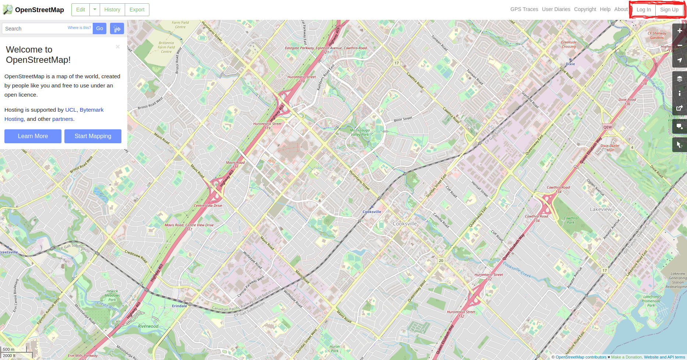
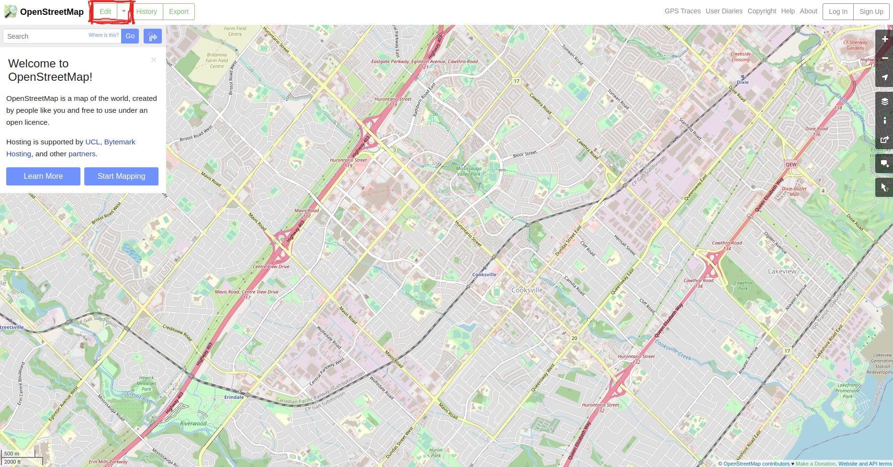
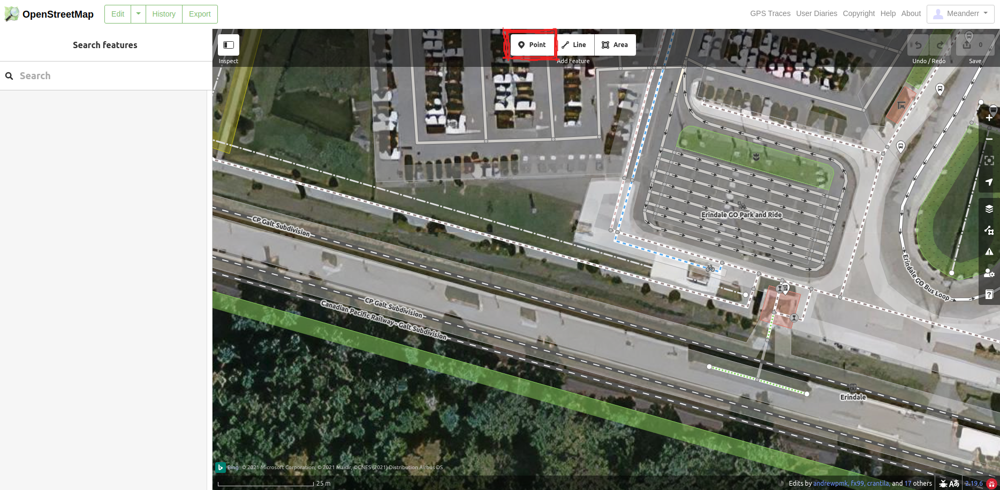
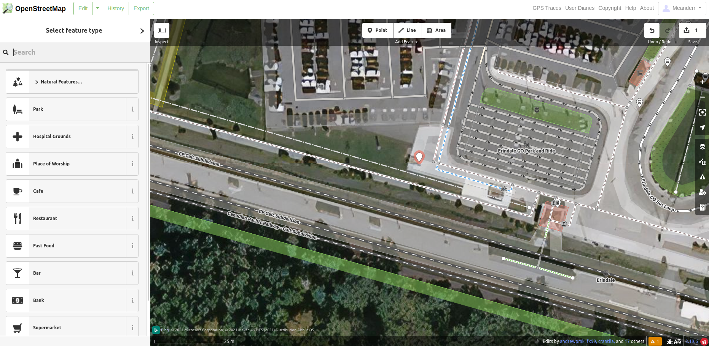
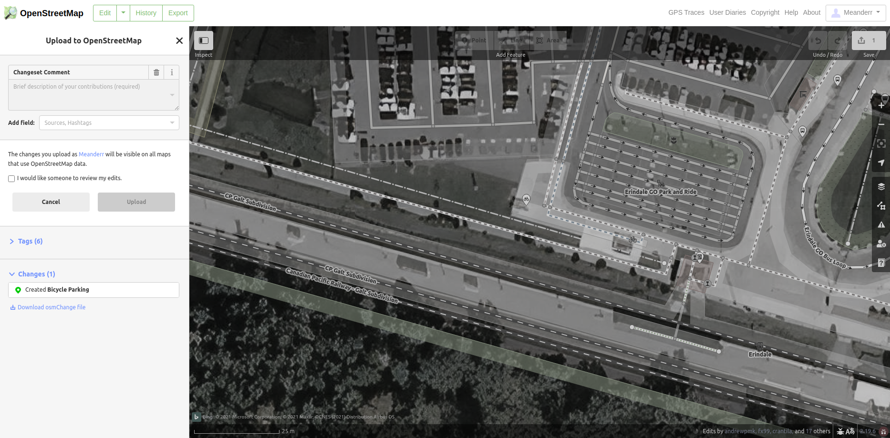

# Edit OpenStreetMap
Goto <a href="www.openstreetmap.org">OpenStreetMap</a> and SignUp for an account or Log In with an existing account:

Once logged in you can put yourself into edit mode by clicking on the Edit button:

Next click Point to be able to then go on the map and place a point:

Next click on the map where you would like to place your point:

Next search for Bicycle Parking as the type of parking you're trying to add:

Fill in the relevant tags you have for attributes of the bike parking.  We find Type, Capacity and Access to be very helpful attributes.  Consult our <a href="TAGGING.md">bike parking tagging guide<a> if you need more information:

Once you're done click Save, write in a comment about what you've added and then click Upload.

Congratulations, you've enterred your first piece of bike parking into OpenStreetMap which is now available to everyone else in the world.

